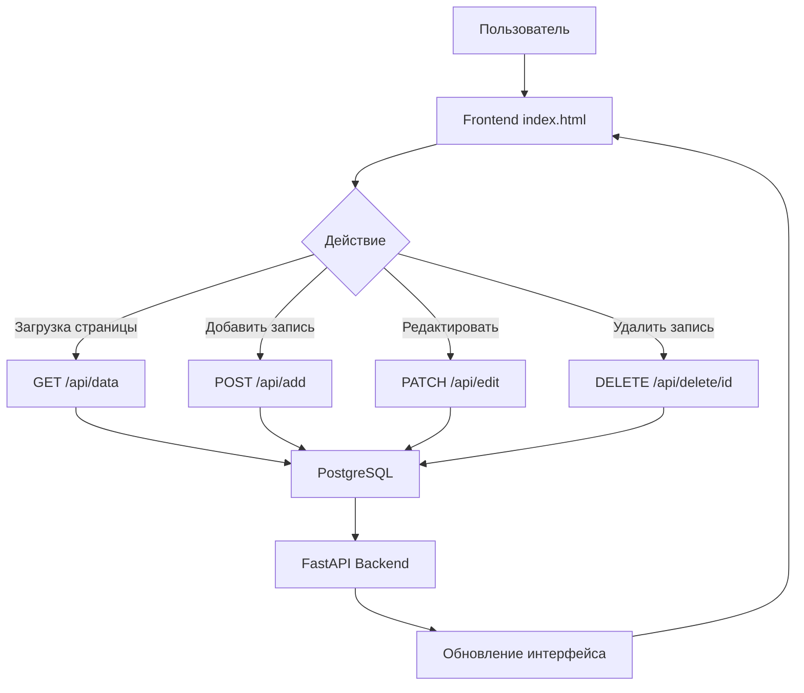

# 🐳 Simple List - Docker + PostgreSQL + FastAPI + JavaScript

Минимальное веб-приложение для управления списком задач с сохранением данных в PostgreSQL. Реализован полный CRUD (Create, Read, Update, Delete) с современным интерфейсом.

## 🚀 Быстрый старт

```bash
# Запустить Docker контейнеры
docker-compose up --build

# Открыть в браузере:
# Frontend: http://localhost:3000
# Backend API: http://localhost:8000
# API Docs (Swagger): http://localhost:8000/docs
# API Docs (ReDoc): http://localhost:8000/redoc
```
## 📁 Структура

``` txt
simple-list/
├── backend/          # FastAPI + PostgreSQL
│   ├── app.py       # API логика
│   ├── Dockerfile   # Контейнер Python
│   └── requirements.txt
├── frontend/        # HTML/JS интерфейс
│   ├── index.html
│   ├── style.css
│   ├── app.js
│   └── Dockerfile   # Контейнер Nginx
└── docker-compose.yml  # Оркестрация
```
---

## 🔧 Технологии

- **FastAPI** - Python бэкенд
- **PostgreSQL** - база данных
- **HTML/CSS/JS** - фронтенд
- **Docker** - контейнеризация
- **Docker Compose** - управление сервисами

## 📝 Функции

✅ Добавление записей  
✅ Просмотр списка  
✅ Удаление записей  
✅ Редактирование записей  
✅ Сохранение в БД  


### Эндпоинты API

| Метод | Endpoint | Описание |
|-------|----------|----------|
| **GET** | `/api/data` | Получить все записи |
| **POST** | `/api/add` | Добавить новую запись |
| **PATCH** | `/api/edit` | Редактировать существующую запись |
| **DELETE** | `/api/delete/{item_id}` | Удалить запись |


### Горячие клавиши

| Клавиша | Действие | Условие |
|---------|----------|----------|
| **Enter** | Сохранить | В режиме редактирования |
| **Escape** | Отмена | В режиме редактирования |

## 🔄 Логика работы приложения

### Взаимодействие компонентов



## 📝 Примеры использования

### ➕ Добавление записи
1. Ввести название в поле **"Наименование"**
2. (Опционально) ввести описание в поле **"Описание"**
3. Нажать кнопку **"➕ Добавить"**

### ✏️ Редактирование записи
1. Нажать кнопку **✏️** в строке записи
2. Изменить текст в полях ввода
3. Нажать **💾** или клавишу **Enter** для сохранения
4. Нажать **❌** или клавишу **Escape** для отмены

### 🗑️ Удаление записи
1. Нажать кнопку **🗑️** в строке записи
2. Подтвердить удаление в диалоговом окне

## 📦 Проект создан для демонстрации работы связки современных технологий:

- 🐳 **Docker** + **Docker Compose** — контейнеризация и оркестрация
- ⚡ **FastAPI** + **PostgreSQL** — высокопроизводительный бэкенд с базой данных
- 🎨 **JavaScript (ES6+)** + **HTML/CSS** — адаптивный пользовательский интерфейс

🔗 GitHub: [EvheniCH-Ufa/Simple-List](https://github.com/EvheniCH-Ufa/Simple-List)
